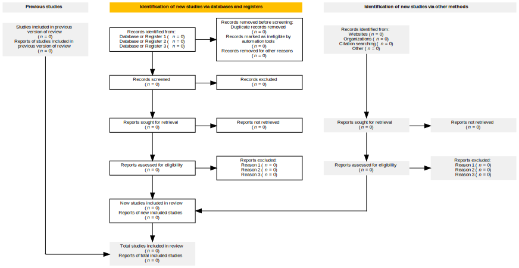

# PRISMA.jl

<br>
<div align="center">

</div>
<br>

`PRISMA.jl` is a Julia package and [web application](https://prisma-jl.onrender.com) powered by [`React.js`](https://react.dev/) and [`Oxygen.jl`](https://github.com/OxygenFramework/Oxygen.jl) for generating checklists and flow diagrams based on [the 2020 **P**referred **R**eporting **I**tems for **S**ystematic **R**eviews and **M**eta-**A**nalyses (PRISMA) statement (Page et al., 2021).](https://doi.org/10.1186/s13643-021-01626-4)

**Features:**

- functions to generate 2020 PRISMA checklists using natural language processing
- functions to upload study data to create 2020 PRISMA flow diagrams via [`Graphviz`](https://graphviz.org/)
- an interactive web app requiring zero programming knowledge

**Installation:** use this command in the Julia REPL: `using Pkg; Pkg.add("PRISMA")`

**Documentation:** <a href="https://cecoeco.github.io/PRISMA.jl/stable/"></a> <a href="https://cecoeco.github.io/PRISMA.jl/dev/"></a>

**Examples:**

create and save a flow diagram:

```julia
using PRISMA: flow_diagram, flow_diagram_save

flow_diagram_save("example.svg", flow_diagram(side_boxes=false))
```

<details>
<summary>show output:</summary>



</details>

view empty checklist data:

```julia
using PRISMA: checklist_df

println(checklist_df())
```

<details>
<summary>show output:</summary>

```
49×4 DataFrame
 Row │ Section and Topic                  Item #  Checklist Item                     Location where item is reported 
     │ String                             String  String                             String                          
─────┼───────────────────────────────────────────────────────────────────────────────────────────────────────────────
   1 │ TITLE
   2 │ Title                              1       Identify the report as a systema…
   3 │ ABSTRACT
   4 │ Abstract                           2       See the PRISMA 2020 for Abstract…
   5 │ INTRODUCTION
   6 │ Rationale                          3       Describe the rationale for the r…
   7 │ Objectives                         4       Provide an explicit statement of…
   8 │ METHODS
   9 │ Eligibility criteria               5       Specify the inclusion and exclus…
  10 │ Information sources                6       Specify all databases, registers…
  11 │ Search strategy                    7       Present the full search strategi…
  12 │ Selection process                  8       Specify the methods used to deci…
  13 │ Data collection process            9       Specify the methods used to coll…
  14 │ Data items                         10a     List and define all outcomes for…
  15 │                                    10b     List and define all other variab…
  16 │ Study risk of bias assessment      11      Specify the methods used to asse…
  17 │ Effect measures                    12      Specify for each outcome the eff…
  18 │ Synthesis methods                  13a     Describe the processes used to d…
  19 │                                    13b     Describe any methods required to…
  20 │                                    13c     Describe any methods used to tab…
  21 │                                    13d     Describe any methods used to syn…
  22 │                                    13e     Describe any methods used to exp…
  23 │                                    13f     Describe any sensitivity analyse…
  24 │ Reporting bias assessment          14      Describe any methods used to ass…
  25 │ Certainty assessment               15      Describe any methods used to ass…
  26 │ RESULTS
  27 │ Study selection                    16a     Describe the results of the sear…
  28 │                                    16b     Cite studies that might appear t…
  29 │ Study characteristics              17      Cite each included study and pre…
  30 │ Risk of bias in studies            18      Present assessments of risk of b…
  31 │ Results of individual studies      19      For all outcomes, present, for e…
  32 │ Results of syntheses               20a     For each synthesis, briefly summ…
  33 │                                    20b     Present results of all statistic…
  34 │                                    20c     Present results of all investiga…
  35 │                                    20d     Present results of all sensitivi…
  36 │ Reporting biases                   21      Present assessments of risk of b…
  37 │ Certainty of evidence              22      Present assessments of certainty…
  38 │ DISCUSSION
  39 │ Discussion                         23a     Provide a general interpretation…
  40 │                                    23b     Discuss any limitations of the e…
  41 │                                    23c     Discuss any limitations of the r…
  42 │                                    23d     Discuss implications of the resu…
  43 │ OTHER INFORMATION
  44 │ Registration and protocol          24a     Provide registration information…
  45 │                                    24b     Indicate where the review protoc…
  46 │                                    24c     Describe and explain any amendme…
  47 │ Support                            25      Describe sources of financial or…
  48 │ Competing interests                26      Identify the report as a systema…
  49 │ Availability of data, code and o…  27      Report which of the following ar…
```

</details>


**Citing:** please consider citing `PRISMA.jl` and giving the GitHub repository a star, if possible.

The citation information may be found in the [`CITATION.bib`](CITATION.bib) file within the repository

**References:**

> Bezanson, J., Edelman, A., Karpinski, S., & Shah, V. B. (2017). Julia: A fresh approach to numerical computing. SIAM Review, 59(1), 65–98. https://doi.org/10.1137/141000671

> Bouchet-Valat, M., & Kamiński, B. (2023). DataFrames.jl: Flexible and Fast Tabular Data in Julia. Journal of Statistical Software, 107(4), 1–32. https://doi.org/10.18637/jss.v107.i04

> Page M J, McKenzie J E, Bossuyt P M, Boutron I, Hoffmann T C, Mulrow C D et al. (2021). The PRISMA 2020 statement: An updated guideline for reporting systematic reviews. Systematic Reviews, 10(1), 89. https://doi.org/10.1186/s13643-021-01626-4
