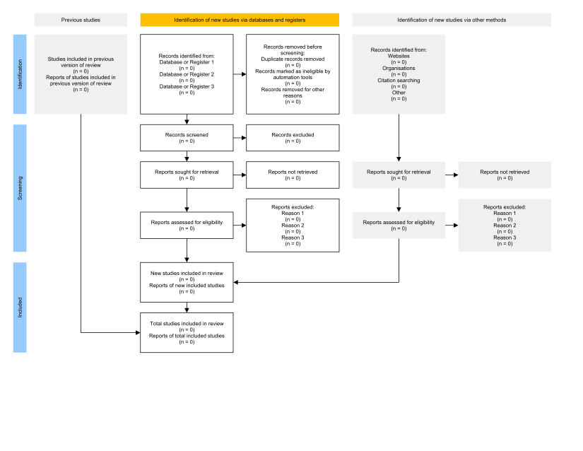

<div align="center">
<b><h1>PRISMA.jl</h1></b>
</div>

PRISMA.jl is a Julia-based software package that generates checklists and flow diagrams for systematic reviews and meta-analyses based on [the <b>P</b>referred <b>R</b>eporting <b>I</b>tems for <b>S</b>ystematic <b>R</b>eviews and <b>M</b>eta-<b>A</b>nalyses (PRISMA) statement (Page et al., 2021).](https://doi.org/10.1186/s13643-021-01626-4) Its companion web application can also be used by researchers with little to no programming experience looking to report the results from their systematic reviews and meta-analyses with transparency and efficiency: [Link coming soon.]()

## Getting Started

If you do not have Julia or a text-editor that supports Julia installed, then you might find this [link](https://julialang.org/learning/) helpful before getting started.

This simple example shows how a few functions in this package can be used together to create a flow diagram:

```Julia
# 1. Install the PRIMSA.jl package.
using Pkg; Pkg.add("PRISMA") 

# 2. Load the PRISMA package.
using PRISMA

# 3. The flow_diagram_csv() function generates a csv template. 
# The path of the template is assigned to the 'data' variable, 
# but in most scenarios the template is edited before it is assigned and read.
data = PRISMA.flow_diagram_csv()

# 4. The flow_diagram_read() function reads the csv saved as 'data' 
# and turns it into a dataframe and assigns it to 'df'.
df = PRISMA.flow_diagram_read(data)

# 5. The flow_diagram() function turns data frames into 
# flow diagrams that show the results of a meta-analysis or systematic review.
figure = PRISMA.flow_diagram(df)

# 6. The flow_diagram_save() function saves the figure and saves 
# it in formats supported by Makie.jl, png is the default.
PRISMA.flow_diagram_save(figure) 
```

Result:


## License

Copyright © 2024 Ceco Elijah Maples

This work is licensed under the [MIT License](https://opensource.org/license/mit/) - see the [`LICENSE`](LICENSE.md) file for details.