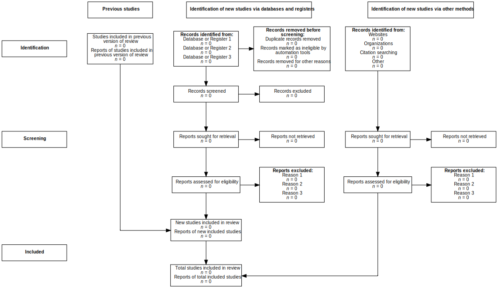

# PRISMA.jl

<br>
<div align="center">

</div>
<br>

`PRISMA.jl` is a Julia package and [web application](https://prisma-jl.onrender.com) powered by [`React.js`](https://react.dev/) and [`Oxygen.jl`](https://github.com/OxygenFramework/Oxygen.jl) for generating checklists and flow diagrams based on [the 2020 **P**referred **R**eporting **I**tems for **S**ystematic **R**eviews and **M**eta-**A**nalyses (PRISMA) statement (Page et al., 2021).](https://doi.org/10.1186/s13643-021-01626-4)

**Features:**

- NLP to generate 2020 PRISMA checklists.
- upload study data to generate 2020 PRISMA flow diagrams.
- interactive web app that requires zero programming knowledge.

**Installation:** use this command in the Julia REPL: `using Pkg; Pkg.add("PRISMA")`

**Documentation:** <a href="https://cecoeco.github.io/PRISMA.jl/stable/"></a> <a href="https://cecoeco.github.io/PRISMA.jl/dev/"></a>

**Examples:**

create and save a flow diagram:

```julia
using PRISMA

flow_diagram_save("flow_diagram.svg", flow_diagram())
```

output:



**Citing:** please consider citing PRISMA.jl and giving the GitHub repository a star, if possible.

The citation information may be found in the [`CITATION.bib`](CITATION.bib) file within the repository

**References:**

> Bezanson, J., Edelman, A., Karpinski, S., & Shah, V. B. (2017). Julia: A fresh approach to numerical computing. SIAM Review, 59(1), 65–98. https://doi.org/10.1137/141000671

> Bouchet-Valat, M., & Kamiński, B. (2023). DataFrames.jl: Flexible and Fast Tabular Data in Julia. Journal of Statistical Software, 107(4), 1–32. https://doi.org/10.18637/jss.v107.i04

> Page M J, McKenzie J E, Bossuyt P M, Boutron I, Hoffmann T C, Mulrow C D et al. (2021). The PRISMA 2020 statement: An updated guideline for reporting systematic reviews. Systematic Reviews, 10(1), 89. https://doi.org/10.1186/s13643-021-01626-4
